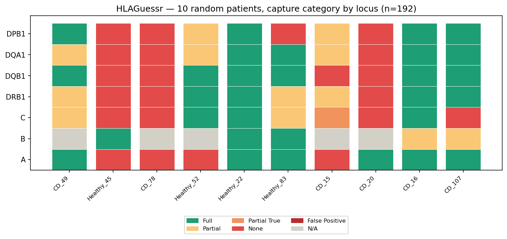
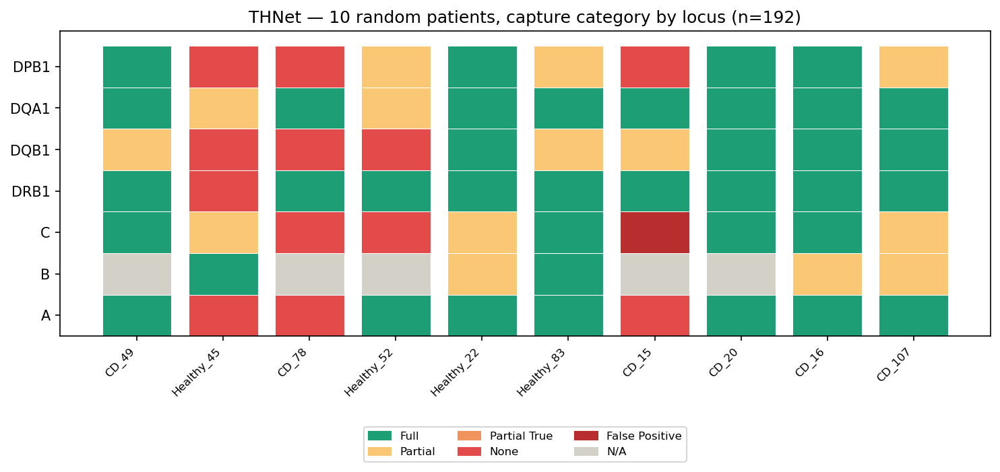
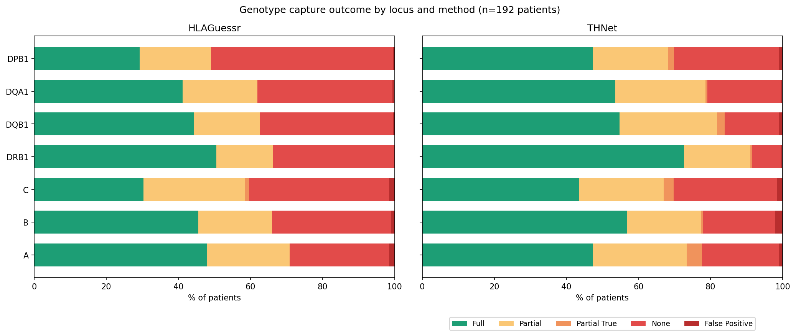

# HLA Inference from TCRαβ Repertoires — Rosati 2022 Cohort

Validation of two independent HLA inference methods (HLAGuessr, THNet) against real HLA genotypes, using the Rosati et al. 2022 Crohn's Disease cohort.

## Background

Rosati et al. 2022 (*Gut*, ENA: PRJEB50045) published bulk TCRαβ repertoires for four clinical groups: Crohn's Disease (CD), Ulcerative Colitis (UC), Colorectal Cancer (CRC), and Healthy controls.

**Note on nomenclature**: "CD" refers to Crohn's Disease, not Celiac Disease.

The publicly available ENA data does not include HLA genotypes. Dr. Elisa Rosati, the corresponding author, was contacted directly and shared:

- TCRα and TCRβ repertoires (RDS format) for three groups: CD, Healthy, and UC (labelled "colitis" in the source files)
- HIBAG-imputed HLA genotypes (SNP-array based) — only for CD and Healthy patients

This made it possible to validate HLA inference against real ground truth for the first time in this project, rather than relying solely on agreement between independent prediction methods.

## What was found in the shared data

The shared RDS files store TRA and TRB separately per patient. A naive unpacking step overwrote the alpha-chain file with the beta-chain file when both shared the same output name — caught and fixed by using chain-specific filenames.

HLA genotypes were provided only for CD and Healthy patients (192 total: 98 CD, 94 Healthy); the UC group has TCR but no HLA. The shared TCR data was confirmed to match the public ENA dataset by clonotype overlap (16–20/20 top clonotypes per patient checked).

One subtlety: Dr. Elisa's HLA file actually has 194 genotyped patients, not 192 — two of them have no matching TCR in her RDS files (their TCR exists only in public ENA data). These two are excluded throughout, so every result here is based on exactly 192 patients.

## Approach

HLAGuessr and THNet were run independently on the ENA/MiXCR-processed repertoire, using only TCR sequence features, before any HLA ground truth was available for this project.

**Important caveat on HLAGuessr**: Rosati's cohort was one of three datasets used in HLAGuessr's own training (alongside Russell et al. and Emerson et al.), with HLA genotypes obtained directly from the authors for that purpose. So HLAGuessr's predictions on this cohort are not fully blind — the model had prior exposure to a subset of these patients' true HLA. THNet, by contrast, was trained on a completely separate set of 4,144 donors and never saw this cohort. Its validation here is genuinely blind and is the more honest test of real-world performance.

Once Dr. Elisa shared the HIBAG genotypes, each method's predictions were compared independently against the real HLA.

No HLA ground truth, per-patient predictions, or per-patient validation outputs are published in this repository. Notebooks are shared without cell outputs, and only aggregate metrics are reported below.

## Repository structure

The repository has four notebooks under `notebooks/`. The first two cover MiXCR processing and inference with HLAGuessr and THNet respectively. The third unpacks Dr. Elisa's RDS files and builds the ground-truth master table. The fourth applies quality control and runs the validation described in this README. A `figures/` subfolder holds three aggregate plots — none of them expose any individual patient's HLA. A `scripts/` folder has the R script used to unpack the RDS files correctly.

## Results

### Quality control

A productive-CDR3 filter (must start with C, end in F or W) and a requirement that CDR1/CDR2 be resolvable from the V-gene dictionary were applied. Only 1.02% of the 19,820,069 raw clonotypes were removed — Elisa's repertoires were already clean. All 192 patients kept at least 1,300 clones per chain, well above the 1,000-clone threshold used elsewhere in this project.

### Validating inference against real HLA

Each method's predictions were compared against the HIBAG genotypes for the 192 patients. For each patient and locus, the patient's real alleles (one if homozygous, two if heterozygous) were compared against the method's positive calls, ranked by probability or score. Because a patient has at most two real alleles per locus, the top-N predicted positives (N = number of real alleles) were taken as the method's genotype call. This matters because a method can correctly identify both real alleles and still raise an extra, lower-confidence false positive — without this top-N approach, that case would be miscounted as a failure.

Five outcome categories per locus were defined:

- **Full**: both real alleles are among the top-ranked positives — genotype fully and correctly captured.
- **Partial**: one real allele captured, the other simply never predicted positive — a straightforward miss.
- **Partial True**: one real allele captured, but the other real allele *was* predicted positive, just outranked by a higher-scoring false positive.
- **None**: neither real allele predicted positive.
- **False Positive**: no real allele captured, but the method raised one or more wrong positive calls anyway.

THNet was checked on two different allele scopes: HLAGuessr's 94 modelable alleles, for a fair side-by-side comparison, and THNet's own native 207-allele scope. The larger 207-allele scope gives THNet more candidate alleles to choose from, which means more room for false positives — informative on its own, but not directly comparable to HLAGuessr's 94.

**Overall allele-level metrics (≥90% confidence threshold)**

Across the 192 patients, there are 2,300 real allele instances in total (restricted to HLAGuessr's 94 modelable alleles). For each one, a method either flags it correctly with ≥90% confidence (a true positive), or fails to reach that confidence even though the allele is real (a false negative) — these two numbers always add up to 2,300. Separately, each method occasionally flags an allele the patient doesn't actually have (a false positive), which is rare for both methods.

| Metric | HLAGuessr (semi-informed*) | THNet (genuinely blind) |
|---|---|---|
| Real alleles (total) | 2,300 | 2,300 |
| True positives | 1,178 | 997 |
| False negatives | 1,122 | 1,303 |
| False positives | 25 | 15 |
| Precision (PPV) | 97.9% | 98.5% |
| Sensitivity | 51.2% | 43.3% |
| **F1-score** | **67.3%** | **60.2%** |

In plain terms: of every 100 real alleles a patient carries, HLAGuessr correctly flags about 51 of them with high confidence, and THNet about 43 — the rest simply don't reach the 90% confidence threshold, which is not the same as being actively called "wrong". When either method does flag something positive, it is right almost every time (97.9–98.5% precision) — false positives are rare (25 and 15 cases respectively, out of well over 2,300 opportunities).

**% of patients with a fully correct genotype, by locus:**

| HLA Class | Locus | Alleles | HLAGuessr (semi-informed*) | THNet, 94 alleles (genuinely blind) |
|---|---|---|---|---|
| Class I  | A    | 12 | 47.9% | 47.4% |
| Class I  | B    | 19 | 45.5% | 56.8% |
| Class I  | C    | 12 | 30.3% | 43.6% |
| Class II | DRB1 | 18 | 50.5% | **72.6%** |
| Class II | DQB1 | 13 | 44.3% | 54.7% |
| Class II | DQA1 | 11 | 41.1% | 53.6% |
| Class II | DPB1 |  9 | 29.2% | 47.4% |

*\*Rosati was part of HLAGuessr's training data — see caveat above.*

**Full breakdown across all five outcome categories, by locus and method:**

| Method | Locus | Full | Partial | Partial True | None | False Positive |
|---|---|---|---|---|---|---|
| HLAGuessr | A    | 47.9% | 22.9% | 0.0% | 27.6% | 1.6% |
| HLAGuessr | B    | 45.5% | 20.5% | 0.0% | 33.0% | 1.1% |
| HLAGuessr | C    | 30.3% | 28.2% | 1.1% | 38.8% | 1.6% |
| HLAGuessr | DRB1 | 50.5% | 15.8% | 0.0% | 33.7% | 0.0% |
| HLAGuessr | DQB1 | 44.3% | 18.2% | 0.0% | 37.0% | 0.5% |
| HLAGuessr | DQA1 | 41.1% | 20.8% | 0.0% | 37.5% | 0.5% |
| HLAGuessr | DPB1 | 29.2% | 19.8% | 0.0% | 50.5% | 0.5% |
| THNet | A    | 47.4% | 26.0% | 4.2% | 21.4% | 1.0% |
| THNet | B    | 56.8% | 20.5% | 0.6% | 19.9% | 2.3% |
| THNet | C    | 43.6% | 23.4% | 2.7% | 28.7% | 1.6% |
| THNet | DRB1 | **72.6%** | 18.4% | 0.5% | 7.9% | 0.5% |
| THNet | DQB1 | 54.7% | 27.1% | 2.1% | 15.1% | 1.0% |
| THNet | DQA1 | 53.6% | 25.0% | 0.5% | 20.3% | 0.5% |
| THNet | DPB1 | 47.4% | 20.8% | 1.6% | 29.2% | 1.0% |

The two methods disagree depending on which metric is used. THNet achieves a higher full-genotype capture rate at every single locus — notable because the comparison favours HLAGuessr, which had prior training exposure to this cohort, while THNet had none. At the individual-allele level, however, HLAGuessr shows higher sensitivity overall (51.2% vs 43.3%), meaning it correctly flags more individual alleles in total; THNet is comparatively better at completing *both* alleles together for the same patient, even though it catches fewer alleles overall. The two metrics are measuring different things — one rewards any correct allele call, the other only rewards a fully completed genotype — and neither method "wins" cleanly across both.

DRB1 remains the strongest locus for both methods; DPB1 and C remain the weakest. "Partial True" — a real allele displaced by a higher-scoring false positive — is rare for both methods (0% for HLAGuessr, 0.5–4.2% for THNet); the dominant failure mode for both is simple omission (a real allele never reaching the confidence threshold), not active confusion between alleles.

A consensus approach was also tested, requiring agreement between both methods at high confidence, and it performed substantially worse than either method alone — requiring cross-method agreement discards valid signal without meaningfully improving precision.

None of these results are comparable to the >90% benchmarks reported for direct molecular HLA typing (NGS/SSO), which sequences genomic DNA rather than inferring genotype from immune repertoire signal.

### Known artefacts

DPA1*01:03 (THNet) is predicted positive in nearly 100% of patients regardless of repertoire content. It is excluded from all validation, consistent with class imbalance in THNet's training data.

## Requirements

A `bioinf` conda environment with Python 3.12, with `hlaguessr`, `thnet`, `pandas`, `numpy`, `scikit-learn`, and `openpyxl` installed.

## Citation

Ruiz Ortega et al. 2025 for HLAGuessr (*PLOS Computational Biology*, DOI: 10.1371/journal.pcbi.1012724); Pan et al. 2025 for THNet (github.com/Mia-yao/THNet); Rosati et al. 2022 for the dataset (*Gut*, DOI: 10.1136/gutjnl-2021-325373, ENA: PRJEB50045).

## Acknowledgements

HLA ground truth data kindly shared by Dr. Elisa Rosati.
