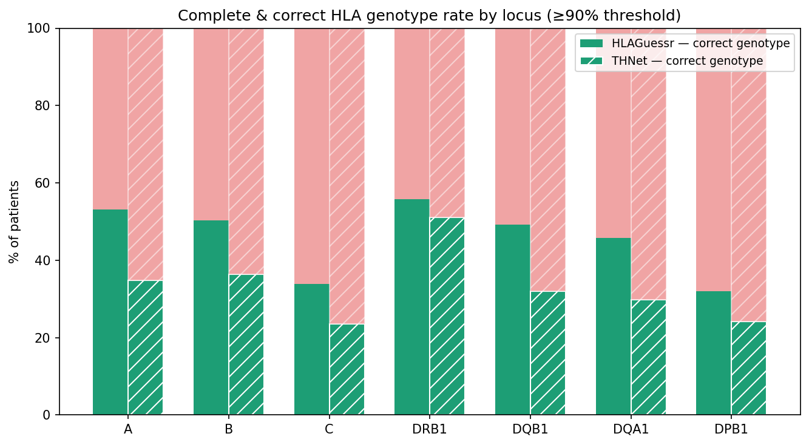

# HLA Inference from TCRαβ Repertoires — Rosati 2022 Cohort

Validation of two independent HLA inference methods (HLAGuessr, THNet) against real HLA genotypes, using the Rosati et al. 2022 Crohn's Disease cohort.

## Background

[Rosati et al. 2022, *Gut*](https://doi.org/10.1136/gutjnl-2021-325373) (ENA: PRJEB50045) published bulk TCRαβ repertoires for four clinical groups: Crohn's Disease (CD), Ulcerative Colitis (UC), Colorectal Cancer (CRC), and Healthy controls.

**Note on nomenclature**: "CD" refers to Crohn's Disease, not Celiac Disease.

The publicly available ENA data does not include HLA genotypes. We contacted the corresponding author, **Dr. Elisa Rosati**, who shared:

- TCRα and TCRβ repertoires (RDS format) for three groups: CD, Healthy, and UC (labelled "colitis" in the source files)
- HIBAG-imputed HLA genotypes (SNP-array based) — **only for CD and Healthy patients**

This made it possible to validate HLA inference against real ground truth for the first time in this project, rather than relying solely on agreement between independent prediction methods.

## What we found in the shared data

- The shared RDS files store TRA and TRB as **separate per-patient tables**, each named with the patient ID (e.g. `1.CD.3.Blood.bulk`). A naive unpacking step overwrites the alpha-chain file with the beta-chain file if both chains share the same output filename — this was identified and corrected by writing chain-specific filenames (`_TRA.tsv` / `_TRB.tsv`), see `see notebook 03`.
- HLA genotypes were provided only for the CD and Healthy groups (192 patients total: 98 CD + 94 Healthy). The UC ("colitis") group has TCR data but no HLA ground truth.
- We confirmed the shared TCR data corresponds to the same sequencing runs as the publicly available ENA dataset (PRJEB50045) by cross-referencing patient IDs and verifying clonotype overlap (16–20/20 top clonotypes matched per patient checked).

## Approach

**Step 1 — Inference (no HLA used as input at run time).**
HLAGuessr and THNet were run independently on the ENA/MiXCR-processed repertoire, using only TCR sequence features. This was performed before HLA ground truth was obtained for this project.

**Important caveat on HLAGuessr**: Rosati et al.'s cohort was one of three datasets (alongside Russell et al. and Emerson et al.) used in the original training of HLAGuessr's classifier (Ruiz Ortega et al. 2025), with HLA genotypes obtained directly from the authors for that purpose. This means HLAGuessr's predictions on this cohort are **not fully blind** — the model had prior exposure to (a subset of) these patients' true HLA during training. High accuracy here was therefore *expected by design*, and this step served to confirm that expectation once ground truth became available to us. **THNet, by contrast, was trained on an entirely independent set of 4,144 donors (Pan et al. 2025) and never saw this cohort** — its validation below is genuinely blind and is the more informative result for assessing real-world inference accuracy on new repertoires.

**Step 2 — Validation against ground truth.**
Once Elisa Rosati shared the HIBAG-imputed HLA genotypes, each method's predictions were compared independently against real HLA to measure accuracy.

> **No HLA ground truth, per-patient predictions, or per-patient validation outputs are published in this repository.** Notebooks are shared without cell outputs, and only aggregate validation metrics (precision, sensitivity, counts) are reported below, in agreement with the data sharing terms.

## Repository structure
notebooks/

01_rosati_hlaguessr_inference.ipynb       # MiXCR processing + HLAGuessr inference

02_rosati_thnet_inference.ipynb           # THNet inference + method comparison

03_rosati_master_table_construction.ipynb # Unpack RDS, build ground-truth master table

04_rosati_qc_hla_validation.ipynb         # QC filtering + validation vs HIBAG ground truth

scripts/

unpack_rosati_rds.R                       # R script: RDS -> per-patient, per-chain TSVs
## Results

### Quality control

A productive-CDR3 filter (`C...F/W`) and CDR1/CDR2-availability filter were applied to the 19,820,069 raw clonotypes shared by Elisa Rosati. Only **1.02% were removed**; all 192 patients retained ≥1,300 clones per chain, well above standard depth thresholds.

### Validating inference against real HLA

Predictions from each method (independently, ≥90% confidence threshold) were compared against the HIBAG genotypes, restricted to HLAGuessr's 94 modelable alleles. "Correct" means the patient's full genotype at that locus (both alleles) was captured — a partial match (one of two alleles) is counted as incorrect, since an incomplete genotype is not clinically actionable.

| Section | Metric | HLAGuessr ≥90% (semi-informed*) | THNet ≥90% (genuinely blind) |
|---|---|---|---|
| **Overall** | Patients validated | 175 | 178 |
| | Predictions made | 1,214 | 1,024 |
| | True positives | 1,188 | 1,009 |
| | False positives | 26 | 15 |
| | Precision (PPV) | 97.9% | 98.5% |
| | Sensitivity | 56.3% | 47.1% |
| | **F1-score** | **71.5%** | **63.8%** |
| **Class I** | A (12 alleles) — % correct genotype | 53.1% | 34.8% |
| | B (19 alleles) — % correct genotype | 50.3% | 36.4% |
| | C (12 alleles) — % correct genotype | 33.9% | 23.6% |
| | **Class I average** | **45.8%** | **31.6%** |
| **Class II** | DRB1 (18 alleles) — % correct genotype | 55.7% | 51.1% |
| | DQB1 (13 alleles) — % correct genotype | 49.1% | 32.0% |
| | DQA1 (11 alleles) — % correct genotype | 45.7% | 29.8% |
| | DPB1 (9 alleles) — % correct genotype | 32.0% | 24.2% |
| | **Class II average** | **45.6%** | **34.3%** |

*\*Rosati was part of HLAGuessr's training data — see caveat above.*



**Key finding**: DRB1 is the most reliable locus for both methods (51–56% fully correct genotypes), while DPB1 and C are consistently the weakest (24–34%) — a pattern reproduced independently by two unrelated methods. Class I and Class II perform similarly on average (~32–46%); **locus identity, not HLA class, is the dominant factor** behind accuracy.

THNet's result is the more meaningful benchmark for real-world performance, since it had no prior exposure to this cohort. HLAGuessr's higher sensitivity is consistent with — and partly explained by — its prior training exposure to this cohort, so the comparison between the two numbers should not be read as "HLAGuessr is simply the better method."

**Threshold sensitivity**: lowering the confidence cutoff from ≥90% to ≥80% made no difference for HLAGuessr (identical 1,188 TP / 26 FP — its probabilities are already near-binary) and only a modest gain for THNet (TP 1,009→1,175, FP 15→19, sensitivity 47.1%→53.8%). Threshold choice in the 80–90% range does not meaningfully change the underlying picture.

Separately, we tested requiring agreement between both methods (consensus ≥90% on both) and found this **substantially worse** than either method alone (sensitivity 8.1%, vs. 56.3%/47.1% individually) — confirming that requiring cross-method agreement discards valid signal without meaningfully improving the already-high precision (~98%) of either method on its own.

None of these results are comparable to >90% benchmarks from direct molecular HLA typing (NGS/SSO), which sequences genomic DNA rather than inferring genotype from immune repertoire signal.

### Known artefacts

- DPA1*01:03 (THNet): predicted positive in nearly 100% of patients regardless of repertoire — excluded from all validation, consistent with class imbalance in THNet's training data.

## Requirements

```bash
conda create -n bioinf python=3.12
conda activate bioinf
pip install hlaguessr thnet pandas numpy scikit-learn openpyxl
```

## Citation

If you use this pipeline, please cite:

- Ruiz Ortega et al. 2025 — HLAGuessr: *PLOS Computational Biology*, DOI: 10.1371/journal.pcbi.1012724
- Pan et al. 2025 — THNet: github.com/Mia-yao/THNet
- Rosati et al. 2022 — dataset: *Gut*, DOI: 10.1136/gutjnl-2021-325373, ENA: PRJEB50045

## Acknowledgements

HLA ground truth data kindly shared by Dr. Elisa Rosati.
